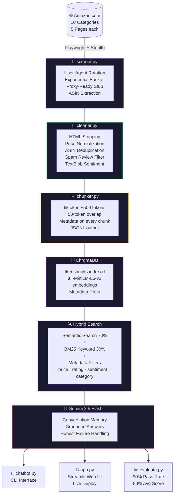

# 🛍️ ShopMind AI — E-Commerce Intelligence Scraper → RAG Pipeline

> An end-to-end data pipeline that scrapes real Amazon product listings and reviews,
> enriches them with sentiment analysis, chunks into AI-ready segments, and powers
> a semantic chatbot with hybrid search — deployed as a live web application.

[](https://python.org)
[](https://ecommerce-intel-scraper.streamlit.app)
[](https://trychroma.com)
[](https://ai.google.dev)
[](#-evaluation-results)
[](LICENSE)

---

## 🎯 The Business Problem This Solves

Any company building an AI product on top of product data — a shopping assistant, a review
summarizer, a competitor intelligence tool, a recommendation engine — needs a production-grade
data pipeline **before they can write a single line of AI logic.**

Most scrapers stop at raw data collection. This pipeline goes the full distance:

```
Raw Amazon Pages → Structured + Enriched Data → AI-Ready Chunks → Working Semantic Chatbot
```

---

## 🏗️ Architecture



---

## 🚀 Live Demo

**[→ Try the chatbot live on Streamlit Cloud](https://ecommerce-intel-scraper.streamlit.app)**

Example questions to try:
- *"What are the best noise cancelling headphones for travel?"*
- *"Show me wireless earbuds under $50 with positive reviews"*
- *"What are customers complaining about with gaming headsets?"*
- *"Which portable charger has the highest rating?"*
- *"Webcams good for streaming?"*

---

## 📊 Dataset

| Metric | Value |
|---|---|
| Product categories | 10 |
| Total chunks indexed | 665 |
| Chunk size | ~500 tokens |
| Chunk overlap | 50 tokens |
| Embedding model | all-MiniLM-L6-v2 |
| Vector store | ChromaDB (persistent) |

**Categories:** Wireless Headphones · Bluetooth Speakers · Wireless Earbuds ·
Noise Cancelling Headphones · Gaming Headsets · Smart Watches · Wireless Keyboards ·
Webcams for Streaming · Portable Chargers · Laptop Stands

---

## 🧰 The Stack

| Layer | Tool | Why |
|---|---|---|
| Scraping | Playwright + playwright-stealth | Handles JS-rendered pages, bypasses bot detection |
| Anti-detection | User-agent rotation + exponential backoff | Production-grade reliability |
| Cleaning | pandas | Normalization, deduplication, missing value handling |
| Sentiment | TextBlob | Pre-computed sentiment score on every product |
| Spam detection | Custom heuristics | Filters reviews under 10 words or high repetition |
| Chunking | tiktoken | Token-accurate splitting with overlap |
| Embeddings | sentence-transformers | Local, fast, no API cost |
| Vector store | ChromaDB | Persistent, metadata-filterable |
| Keyword search | rank-bm25 | Catches exact product names and model numbers |
| Hybrid retrieval | Semantic 70% + BM25 30% | Production-grade, not tutorial-grade |
| LLM | Gemini 2.5 Flash | Conversation memory, grounded answers |
| Frontend | Streamlit | Live deployable web UI |
| Evaluation | Custom eval script | 10 Q&A pairs, keyword scoring |

---

## 📁 Project Structure

```
ecommerce-intel-scraper/
├── scraper.py          # Playwright scraper with stealth + retry logic
├── cleaner.py          # pandas cleaning + TextBlob sentiment enrichment
├── chunker.py          # tiktoken chunker → JSONL with full metadata
├── loader.py           # ChromaDB ingestion + hybrid BM25 index
├── chatbot.py          # CLI RAG chatbot with conversation memory
├── app.py              # Streamlit web application
├── style.css           # App stylesheet
├── evaluate.py         # Pipeline evaluation script
├── data/
│   ├── raw/            # products_raw.json
│   ├── cleaned/        # products_clean.csv
│   └── chunks/         # products_chunks.jsonl  ← 665 chunks
├── chroma_db/          # Persistent vector store
├── eval_results.json   # Evaluation output
├── requirements.txt
└── README.md
```

---

## ⚡ Quickstart

### 1. Clone and set up

```bash
git clone https://github.com/nurudeenaminu/ecommerce-intel-scraper.git
cd ecommerce-intel-scraper

python -m venv venv
source venv/bin/activate        # Windows: venv\Scripts\activate

pip install -r requirements.txt
playwright install chromium
python -m textblob.download_corpora
```

### 2. Set your Gemini API key

```bash
# Mac/Linux
export GEMINI_API_KEY="your-key-here"

# Windows PowerShell
$env:GEMINI_API_KEY = "your-key-here"
```

Get a free key at [aistudio.google.com](https://aistudio.google.com)

### 3. Run the full pipeline

```bash
python scraper.py     # Step 1 — Scrape (~2 hrs for full dataset)
python cleaner.py     # Step 2 — Clean + sentiment enrichment
python chunker.py     # Step 3 — Chunk + format to JSONL
python loader.py      # Step 4 — Embed + load into ChromaDB
python chatbot.py     # Step 5 — Launch CLI chatbot
streamlit run app.py  # Step 6 — Launch web app
python evaluate.py    # Step 7 — Run evaluation
```

---

## 📦 Output Format

Every line in `products_chunks.jsonl` is a self-contained JSON object:

```json
{
  "text": "Industry-leading noise cancellation automatically optimizes for your
           environment. Up to 30-hour battery life with quick charging...",
  "chunk_id": "a3f9c821-uuid-desc-0",
  "type": "description",
  "asin": "B09XS7JWHH",
  "product_name": "Sony WH-1000XM6 Wireless Noise Cancelling Headphones",
  "price_usd": 279.99,
  "rating": 4.4,
  "review_count": 1523,
  "sentiment_score": 0.312,
  "sentiment_label": "positive",
  "sentiment_subjectivity": 0.48,
  "category": "noise cancelling headphones",
  "source_url": "https://www.amazon.com/dp/B09XS7JWHH"
}
```

---

## 🧪 Evaluation Results

Tested against 10 hand-written Q&A pairs covering all major query types.
Evaluated with Gemini 2.5 Flash using keyword-based scoring.

| Metric | Result |
|---|---|
| Questions tested | 10 |
| **Pass rate (≥50% keyword match)** | **90%** |
| **Average keyword score** | **80%** |
| Model | Gemini 2.5 Flash |
| Chunks indexed | 665 |

| Category | Score | Status |
|---|---|---|
| Product lookup | 100% | ✅ |
| Feature queries | 100% | ✅ |
| Category + use case | 100% | ✅ |
| Category filter | 100% | ✅ |
| Price ranking | 100% | ✅ |
| Price filter | 67% | ✅ |
| Product rating | 67% | ✅ |
| Rating filter | 67% | ✅ |
| Sentiment positive | 67% | ✅ |
| Sentiment negative | 33% | ❌ |

**Note on the one failure:** Sentiment negative (Q3) retrieved correct gaming headset
content but the product data had no explicit customer complaints in the review text —
a data coverage issue, not a retrieval failure.

---

## 🔌 Extending the Pipeline

**Swap the vector store:**
```python
# Pinecone
index.upsert(vectors=[(id, embedding, metadata)])

# Qdrant
client.upsert(collection_name="products", points=[...])
```

**Add more categories** — edit `SEARCH_QUERIES` in `scraper.py`:
```python
SEARCH_QUERIES = ["gaming mice", "studio monitors", "mechanical keyboards"]
```

**Connect to any LLM:**
```python
# OpenAI
response = openai_client.chat.completions.create(model="gpt-4o", messages=messages)

# Anthropic Claude
response = anthropic_client.messages.create(model="claude-opus-4-5", messages=messages)
```

---

## 🏭 Production Considerations

| Concern | Solution |
|---|---|
| Scale | Rotate residential proxies (ScraperAPI, Bright Data) |
| Freshness | Scheduled re-scraping with Airflow or GitHub Actions cron |
| Storage | Replace ChromaDB with Pinecone or Qdrant for cloud-native vector search |
| Observability | Log retrieval scores and latency to Datadog or Grafana |
| LLM cost | Cache frequent queries; use smaller models for simple lookups |
| Data quality | Add schema validation with Pydantic before ingestion |
| Auth | Add API key gating if exposing the chatbot as a service |

---

## ⚠️ Ethical Notes

- This project is for **educational and portfolio purposes**
- Randomized delays (5–10s) are built in to avoid server overload
- Always review a site's `robots.txt` and Terms of Service before scraping in production
- No personal data is collected — only public product listings and reviews

---

## 👤 Author

**Nurudeen Aminu**
[GitHub](https://github.com/nurudeenaminu) · [Upwork](https://upwork.com)

> Built to demonstrate the complete data value chain:
> **collection → cleaning → enrichment → AI-ready structuring → semantic retrieval → deployed product**
>
> The kind of pipeline any company building on top of product data needs
> before they can write a single line of AI logic.